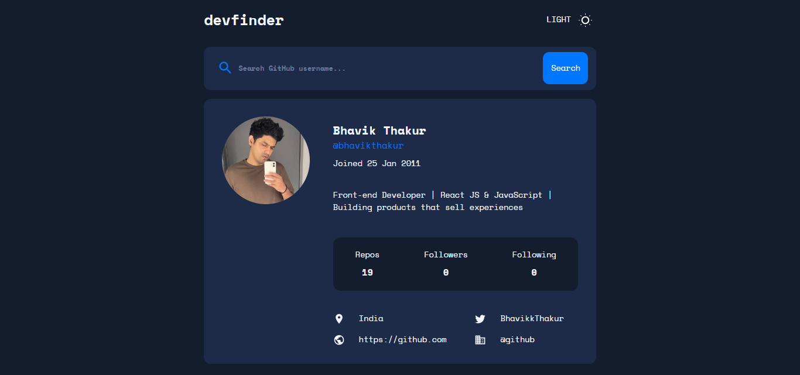
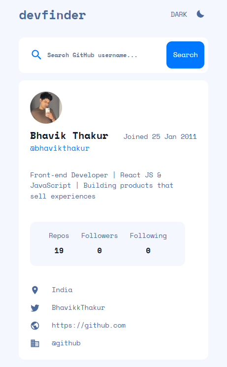

# GitHub User Search App




A responsive GitHub user search application with light/dark mode toggle, inspired by a Frontend Mentor challenge. Search for any GitHub user and view their profile information, repositories, followers, and more.


## Live URL
[GitHub User Search App](https://bhavikthakur.github.io/github-user-search-app/)

## Table of Contents

- [Features](#features)
- [Technologies](#technologies)
- [How to Use](#how-to-use)
- [Installation](#installation)
- [Credits](#credits)
- [Connect with me](#connect-with-me)
- [License](#license)

## Features

- 🔍 Search any GitHub user by username
- 🌓 Light/dark mode toggle
- 📱 Fully responsive design (mobile, tablet, desktop)
- 📊 Display user stats (repos, followers, following)
- 🔗 View user's social links (GitHub, Twitter, blog)
- 🚫 Error handling for invalid searches
- ⚡ Fast, modern UI with smooth transitions

## Technologies

- HTML5 (semantic markup)
- CSS3 (custom properties, Flexbox, Grid)
- JavaScript (ES6+, Fetch API)
- GitHub REST API v3
- Mobile-first workflow

## How to Use

1. Enter a GitHub username in the search field
2. View the user's profile information:
   - Avatar image
   - Bio
   - Join date
   - Repository count
   - Follower/following counts
   - Location, website, and social links
3. Toggle between light and dark mode using the theme switcher

## Installation

1. Clone the repository:
   ```bash
   git clone https://github.com/bhavikthakur/github-user-search-app.git
2. Navigate to the project directory:
   cd github-user-search-app

3. Open index.html in your browser:
   No build tools or dependencies required - works directly in the browser!
   
## Credits
Design Inspiration: Frontend Mentor Challenge <br>
GitHub API: GitHub REST API v3 <br>
Icons: Tabler Icons <br>
Font: Space Mono <br>

##  Connect With Me  
👨‍💻 GitHub: [bhavikthakur](https://github.com/bhavikthakur)  <br>
💼 LinkedIn: [Bhavik Thakur](https://www.linkedin.com/in/bhavik-thakur/)  <br>
🐦 Twitter: [Bhavik Thakur](https://x.com/BhavikkThakur)  <br>


##  License 
License
This project is licensed under the MIT License - see the LICENSE file for details.

